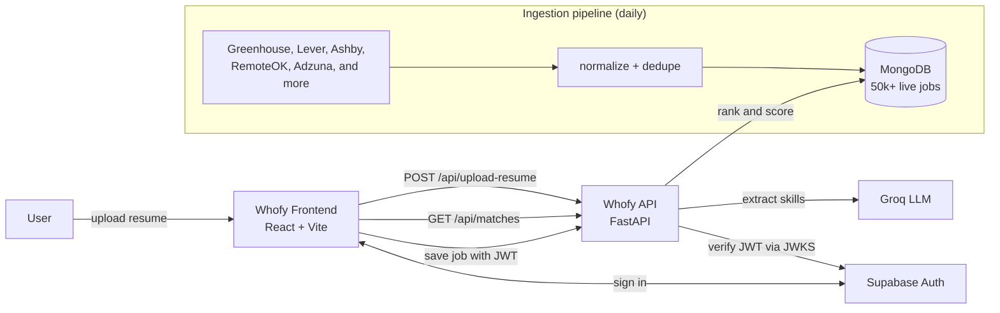

<div align="center">

# Whofy

### We hunt opportunity for you.

Upload your resume once. Whofy reads your skills with AI and returns a ranked shortlist of live tech jobs matched to you — in under a minute. **No sign-up required.**

**[🌐 Live demo → whofy.vercel.app](https://whofy.vercel.app)**


</div>

> This is the **frontend** of Whofy. The backend (FastAPI + MongoDB + the job-ingestion pipeline) lives in a separate repo: **[whofy-api](https://github.com/whofy/whofy-api)**.

---

## Overview

**Whofy** turns a resume into a ranked job shortlist. You drop in a PDF or DOCX, an LLM extracts your skills, location, and experience, and the app matches you against a database of **50,000+ live tech roles** aggregated daily from company career pages and job boards. Browsing and matching need **no account** — you only sign in to save jobs across devices.

## ✨ Features

- **Drag-and-drop resume upload** (PDF / DOCX) with instant AI parsing
- **Ranked matches** scored by how many of your skills a role needs
- **Rich filtering** — skills, location, source, work type (Remote / Hybrid / On-site), experience level, date posted
- **Split-view results** — job list + full detail pane, with a mobile bottom-sheet
- **Keyboard navigation** — ↑/↓ to move through jobs
- **Saved jobs** synced to your account (Supabase JWT → backend)
- **Auth** — email/password **and** Google OAuth, with account management and self-serve account deletion
- **In-app assistant** — a scoped chatbot for help with jobs and the platform
- **Fast, responsive, accessible** — works from 320px phones to desktop, toast feedback, skeleton loaders

## 🛠️ Tech stack

| Layer | Tech |
|-------|------|
| Framework | React 19 + Vite 8 |
| Routing | React Router 7 |
| Auth | Supabase (`@supabase/supabase-js`) |
| Styling | CSS Modules + a design-token system |
| SEO | react-helmet-async, Open Graph tags |
| Analytics | Vercel Web Analytics |
| Hosting | Vercel |

## 🏗️ Architecture



The frontend is a pure SPA: it talks to the FastAPI backend over REST for jobs/matching/saved-jobs, and to Supabase directly for authentication. Auth tokens (Supabase JWTs) are attached to backend calls and verified server-side.

## 🚀 Getting started

**Prerequisites:** Node 18+, and the [whofy-api](https://github.com/whofy/whofy-api) backend running locally (or a deployed URL).

```bash
git clone <this-repo> whofy-ui
cd whofy-ui
npm install
cp .env.example .env   # then fill in the values below
npm run dev            # http://localhost:5173
```

Scripts: `npm run dev` · `npm run build` · `npm run preview` · `npm run lint`

## 🔐 Environment variables

Create a `.env` in the project root:

| Variable | Description |
|----------|-------------|
| `VITE_API_URL` | Base URL of the whofy-api backend (e.g. `http://localhost:8000`) |
| `VITE_SUPABASE_URL` | Your Supabase project URL |
| `VITE_SUPABASE_ANON_KEY` | Supabase publishable (anon) key — safe for the browser |

> The Supabase **service-role** key is **never** used here — it lives only in the backend.

## 📁 Project structure

```
src/
├── api/          # REST client for the backend
├── components/   # Navbar, JobCard, DetailPane, FilterBar, Toast, ...
├── context/      # Auth + SavedJobs providers
├── chatbot/      # in-app assistant
├── hooks/        # shared hooks
├── pages/        # Home, Results, SavedJobs, Auth, AccountSettings, ...
├── styles/       # design tokens + global styles
├── utils/        # helpers
├── App.jsx       # routes + layout
└── main.jsx      # entry, providers
```

## 🗺️ Roadmap

- Semantic / vector matching (embeddings) to move beyond keyword matching
- Retrieval-augmented (RAG) assistant over the live job data
- Applied-jobs tracker and email match alerts

## 👤 Authors

Built as a full-stack project by **Rohan Akode** and **Charan Goud**.
